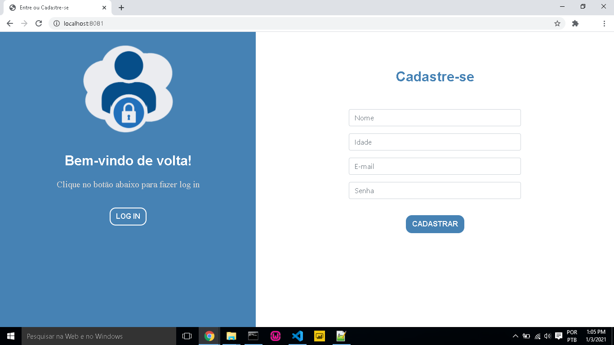

# Sistema de login com Node.js e MySQL e Site HTML5
Este repositório faz referência à uma simples aplicação de login desenvolvida com Node.js em conjunto com o banco de dados MySQL. Para o front-end utilizou-se o framework Bootstrap. e uma tela inicial simples de html com css realizando um breve exemplo de site de uma loja de acai, como nosso exemplo foi pegado como modelo a bolt açaí. 

<h2> Tecnologias Utilizadas </h2>

- [Node.js](https://nodejs.org/en/)
- [MySQL](https://www.mysql.com/)
- [Bootstrap](https://getbootstrap.com/)
- [jQuery](https://jquery.com/)
- [HTML5](https://developer.mozilla.org/en-US/docs/Web/Guide/HTML/HTML5)
- [CSS](https://developer.mozilla.org/en-US/docs/Web/CSS)

<h2> Banco de dados </h2>

Incialmente é preciso criar um banco de dados no MySQL.

```
CREATE DATABASE dblogin;

use dblogin;

CREATE TABLE users(
	id INTEGER PRIMARY KEY AUTO_INCREMENT,
    email VARCHAR (100) NOT NULL,
    pass INTEGER NOT NULL

);
```

<h2> Páginas </h2>


<h2> Contato </h2>
Instagram
https://www.instagram.com/marcelo_win369/
Linkedin
https://www.linkedin.com/in/marcelo-henrique-a-7a42aa139/
